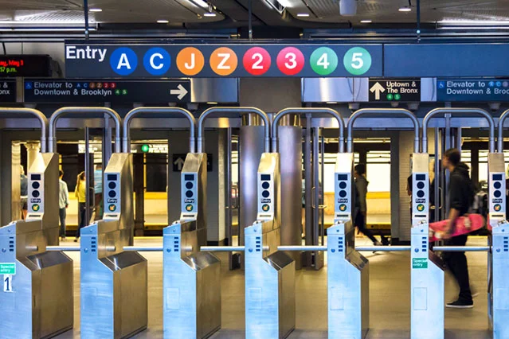
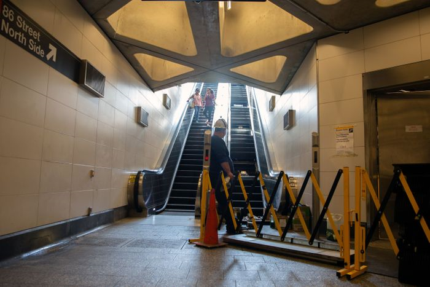
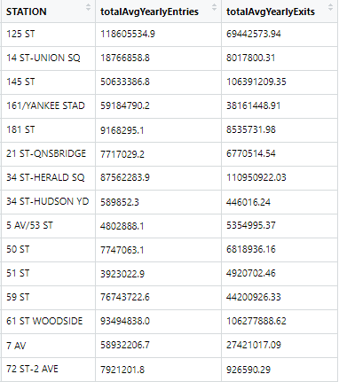
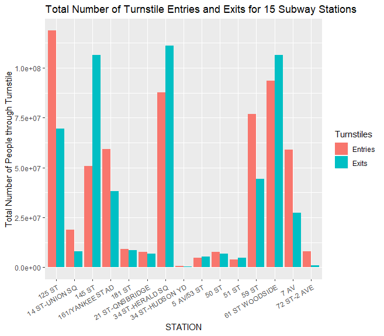
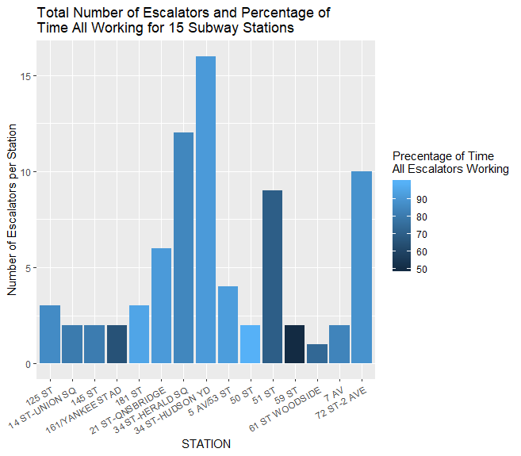
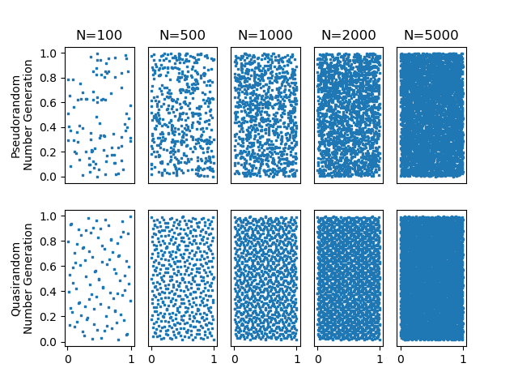
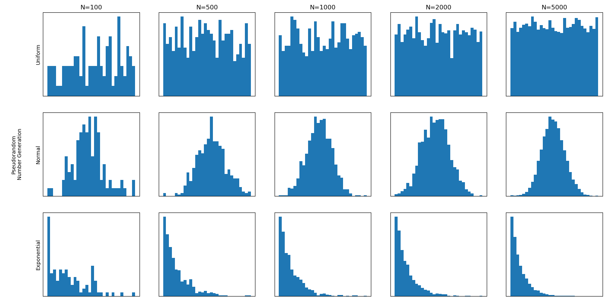
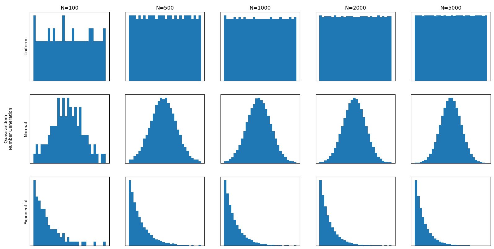

# Assignment 1 - Designing Models and Analyzing Data 
(remove: **text between brackets to be removed**)

> * Participant name: Lauren Massey
> * Project Title: (Title of the problem you are looking and modeling)

# General Introduction

The first part of this assignment explores designing models (and basic Python/Git features). 

We will look at **subway model in a city** system. A **subway system** is an underground, tube, or metro, underground railway system used to transport large numbers of passengers within urban and suburban areas - modern subways use different types of electronic data collection sensors to supply information which is used to manage assets and resources efficiently. 

The second part of the assignment explores data analysis. Data analysis and visualization is key to both the input and output of simulations. This assignment explores different random number generators, distributions, visualizations, and statistics. Additionally, it will look at getting you accustomed to specifying input and output variables to a system. We will also practice working with real data.

# Part 1: Designing a Model - Subway System

New York City has an estimated population of 8,398,748, as of July 2018, that live within 306 square miles [1][2]. This creates a population desnisty of about 27,443.06 people per square mile][2]. The resulting congested streets of NYC have lead to the usage of an underground subway system. This subway system is a common way to travel efficently through the NYC and consists of 472 stations that serve 27 subway lines [2]. It is estimated that the average day rideship for the NYC subways system is 5,437,587 people[4]. The US Census Bureau estimates that NYC's population will continue to grow at a rate of 3% each year or approximately a population growth os 27,000 persons[1]. This evergrowing population will consquently put more demand on the NYC subway system.

The NYC subway system uses escalators to transport riders to and from the underground platforms. Of the 472 stations, 59 have escalators[5]. The direction of an escalator at a certain time can reduce the congestion a station may expereince, especially during rush hour. With the increasing popultion of riders in NYC, usage of these escalators need to be optimatized to ensure efficent transportation through the NYC subway system. A discrete-simualtion of rideship at stations with escalators could be used to model the direction of escalators and how riders stand or walk on the escalators to assess the throughput of riders to and from the platform. The changing of direction of the escalators is not an uncommon practice it is used often when peak transit of people will be going in the same direction, such as exiting a sport stadium after a game. The usage of riders on escalators has been assessed several times before and has found standing, rather than walking, is more efficient[6].

The Metropolitan Transportation Authority (MTA) generates data multiple times a day on the amount of riders that have entered and exited a certain station via the turnstiles[5]. The data is collected nine times a day: 12am, 4am, 8am, 12pm, 4pm, 8pm. This data will be useful in the simualtion to know the throughput at subway stations at certain time intervals.

[7]

Also, MTA produces performance data about the percentage of time each escalator is fully functioning[5].  This can be used to simulate the strain of travel when an escalator is down and what should be done with the remaining escalators at that station [5].

[8]

However, finding details on the length of each escalator in the NYC subway system could not be found. Therefore, a set length of an escalator will be used of 60ft, based on the standard rise of an escalator [9].

**Hypothesis 1:** Changing the direction of escalators will improve the throughput of riders to and from the subway platforms.

**Hypothesis 2:** All riders standing on the escalators will improve the throughput of riders to and from the subway platforms.

**Null Hypothesis 1:** Changing the direction of the escalators will *not* improve the throughput of riders to an from the subway platforms.

**Null Hypothesis 2:** All riders standing on the escalators will *not* improve the throughput of riders to and from the subway platforms.

**_References_**
1. https://www1.nyc.gov/site/planning/planning-level/nyc-population/current-future-populations.page
2. https://www.newworldencyclopedia.org/entry/New_York_City
3. http://web.mta.info/nyct/subway/howto_sub.htm
4. http://web.mta.info/nyct/facts/ridership/
5. http://web.mta.info/developers/developer-data-terms.html#data
6. https://www.insidescience.org/news/faster-commute-stand-dont-walk-escalator-research-suggests
7. https://truthout.org/articles/arrested-for-jumping-a-turnstile-how-new-york-city-punishes-the-poor/
8. https://thecity.nyc/2019/07/nycs-second-avenue-subway-escalators-fail-to-rise-report.html
9. https://www.encyclopedia.com/literature-and-arts/art-and-architecture/architecture/escalator

## (Part 1.1): Requirements (Experimental Design) **(10%)**

**Problem**
The throughput of riders in the NYC subway system can get congested at certain time intervals in a day. Optimizing the direction of the subway escalators may alleviate some of the congestion by providing more paths in a desired direction during peak hours.

**Requirements**
* The simulation shall consist of at least one escalator.
* The simulation shall have allow the speed of the escalator to be set between 90 - 180 feet.
* The simulation shall not allow the speed of the escalator to change when patrons are on it.
* The simulation shall allow us to change the speed of patrons entering the escalator.
* The simulation shall allow us to change the speed of patrons exiting the escalator.
* The simulation shall require all patrons in the subway system to use the escalators to enter and exit the system, unless only one escalator exists at the station.
* The simulation shall allow the direction of the escalator to be changed.
* The simulation shall not allow the direction of the escalator to change while a patron is on it.
* The simulation shall not allow more than two patrons to occupy one step on an escalator.
* The simulator shall allow for the following two tpes of patrons: standing, walking

## (Part 1.2) Subway (My Problem) Model **(10%)**

* [**Object Diagram**](model/object_diagram.md) - provides the high level overview the relationship of the objects in this simulation
* [**Class Diagram**](model/class_diagram.md) - provides details of the classes in this simualtion
* [**Behavior Diagram**](model/behavior_diagram.md) - provides details of an activity diagram of a patron through the simulation

## (Part 1.3) Subway (My Problem) Simulation **(10%)**

**Type of Simualtion**
Discrete Simulation

**Inputs**
* MTA generates data multiple times a day on the amount of riders that have entered and exited a certain station via the turnstiles[5]. The data is collected nine times a day: 12am, 4am, 8am, 12pm, 4pm, 8pm. This data will be useful in the simualtion to know the throughput at subway stations at certain time intervals.
* MTA provides information about which station have escalators. This will lower the scope of which station's to simulate by removing those without escalators.
* MTA produces performance data about the percentage of time each escalator is fully functioning[5].  This can be used to simulate the strain of travel when an escalator is down and what should be done with the remaining escalators at that station [5].

**Outputs**
* Average amount of time a patron takes to transit through the simulation at various times of the day.
* Average amount of  patrons on the escalator at a given time.
* Average length of wait time to get onto the escalator at various times of the day.

**Analyzation of the Simulation**
Overall, the goal is the increase the throughput of the stations by optimizing the usage of the escalators. Based on the amount of time a patron takes to transit through the simulation will indicate if changing the direction of the ecalators based on demand and the placement of patrons on the escalatos makes a difference.

## (Part 1.4) Subway City (My Problem) Model **(10%)**
[**Code template**](code/README.md) - Starting coding framework for the (insert your exact problem here.)
You are expected to create the python files - the code should run without errors, create and object(s) for your system, but not provide function detail.

## (Part 1.5) Specifying the Inputs to a System **(10%)**

**Independent Variables**
* Amount of patrons in the system
* Speed of the escalator
* Time of day
* Amount of escalators
* Length of escalator

**Dependent Variables**
* Time a patron is in the queue
* Time a patron is on the escalator

**Data:**
The data used for this simulation are dervied from a subset of real data from [MTA Real Time Data Feeds.](http://web.mta.info/developers/developer-data-terms.html#data "MTA Data Page") In particular, *Turnstile Usage Data* and *Performance Data.*

**Analyzation of the Model:**
R is a powerful tool that can handle large amount of data.  I plan on using R to analyze my data. In R, I will create the follow statistics:
* Averages time in queue by station
* Maximum time in queue for each station
* Minimum time in queue for each station
* Comparison across stations of means, max, and min amounts.

**Visualiztion of the Data:**
The following charts may be used in the visualization of the data collected:
* Bar graph of amount of throughput at a station over time.
* Bar graph of comparison of average throughput from all 59 stations
* Line graph of wait time in queue over time
* Comparison of stations using line graphs of wait time in queue over time

Plot.ly may be leveraged to provide a way to illustrate the visualizations in a sharable dashboard.

# Part 2: Creating a Model from Code

## (Part 2.1) **P**ortable **O**rganic **T**rouble-free **S**elf-watering System (**POTS**) Model **(10%)**
Here [**we provide an overview**](code/POTS_system/README.md) of the **P**ortable **O**rganic **T**rouble-free **S**elf-watering System (**POTS**) Model and provide a source code template for the code found in  [**the following folder**](code/POTS_system/).

# Part 3: Data Analysis

## (Part 3.1) - Real Data **(10%)**
Two data files have been found for this simulation both were found from the [MTA Real Time Data Feeds.](http://web.mta.info/developers/developer-data-terms.html#data "MTA Data Page")

**Turnstile Data**
This data in txt formats that are automatically created eight times a day and upload to the website linked above. Each data file consists of several data types, however after reviewing the raw data, I decided on to only use the following columns from the txt files:

| Data    | Type         | Description                                       |
|:--------|:-------------|:-----------------------------------------------   |
|Station  | string        |Indicates what station the data was collected at. |
|Date     | datetime      |Date of data collected                            |
|Time     | datetime      |Time of data collected                            |
|Entries  | double        |Amount of entries since last data collection      |
|Exits    | double        |Amount of exits since the last data collection    |

.

**Escalator Performanace Data**
This data consisted of performance data of each escalator within the NYC subway system. The table below describe the raw data set.

| Data    | Type         | Description                                       |
|:--------|:-------------|:-----------------------------------------------   |
|Station  | string        |Indicates what station the data was collected at. |
|NumEs    | double        |Amount of escalators at a station                 |
|UpTime   | float         |Percentage of time the escalator was usable       |
|Line     | [string]      |An array of strings of which subway lines were connected to that station|

.

**Data Munging and Analysis**
A year's worth of txt files were pulled and combined into one csv file using python. However, once this file was created, it was too large for python the handle without having a memory error. Therefore, I imported to the csv to R and compelted this portion of the assignment. I then took the large csv file and decreased the size of it based on the amount stations that had at least one escalator. This reduced my number of stations from over 472 to 59 stations.

I then used the data to create this table of average entries and exits over a year.

This table has all 59 stations represented. The cut above is just the first 15 stations. These first 15 stations were used to create the visualization shown below that compares the entries and exits of 15 stations. Also, this visualization allows viewers to see which stations have more riders than others.

The data set from the escalator performance was not only used to reduce the amount of data entries in the turnstile data set but also can be used to visualize which stations have better maintained escalators than other stations. Insterestingly, 59st is a fairly busy station according to the first visualization and based on the second visualization is has about 50% up time on the one escalator at that station. This could be a place to investigate in the data as bottleneck for congestion of patrons. 

*Notes*
The csv file created in python was too big to upload. If you want to recreate the csv you must run the python script found [**here**](analysis/turnstileCounts.py)

## (Part 3.2) -  Plotting 2D Random Number Generators **(15%)**

The image below describes the difference between using a pseudorandom number generator and a quasirandom number generator.

A pseudorandom number generator will create point in the given range completely random. It has no information about other points created which creates uncorrelated plot points.  This creates the output shown on the top row.

Quasirandom number generator will fill the given range uniformly. This type of number generation is constrained by knowledge of the other points previously generated. This creates a more uniformed output as shown in the second row.

*Notes*
The top row was created using random class within python.
The second row was created using sobol.

## (Part 3.3) -  Plotting 1D Random Distributions **(15%)**

The section consists two plot groupings of random number generators. The first subplot group consists of pseudorandom number generation using three distribution types: uniform, normal, and exponential. As the amount of number generations grows, the historgrams begin to take the shape of their distibution type.

The second subplot uses quasirandom number generation of the same three distributions used in the pseudorandom subplot above. Quasirandom number generator will fill the given range uniformly. This type of number generation is constrained by knowledge of the other points previously generated.

Thr first subplot using pseudorandom number generation does will generate numbers completely random. In the graphs with lower n values, you can see the distribution widespread and not distributed evenly. In the quasirandom number generation, the numbers are generated unformly based on the previously created numbers in the set. The will create a more even distrbution of numbers generated. Thus, reaching the desired shape of the distribution type quicker.

