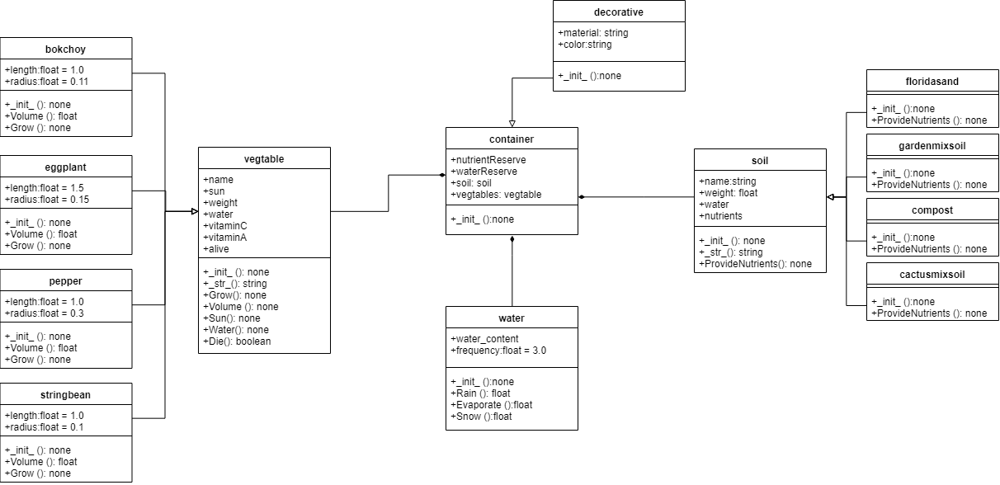

## **P**ortable **O**rganic **T**rouble-free **S**elf-watering System (**POTS**) Model
The POTS model simulates water and nutrient levels of containers of various vegetables (string beans, egglplant, peppers, and bok choy). Each iteration of the simulation will report the container's water reserve and nutrient levels. The simulation will run until the water and nutrient levels drop enough that the plants die.

The class diagram below provides the interaction each class in the software has with another and the internal variables and actions for a class.

In this model there is four vegetables that extend the vegetable class. Each of the vegetables have a different length and radius. The vegetables are populated in a container (this container could be a decorative one) that consists of only gardenmixsoil. However, in  the model there is other classes of soil that could be used (floirdasand, catcusmixsoil, and compost) Each teration of the simulation nutients from the soil and water deminishes. This eventually kills the plants.

Class Diagram

