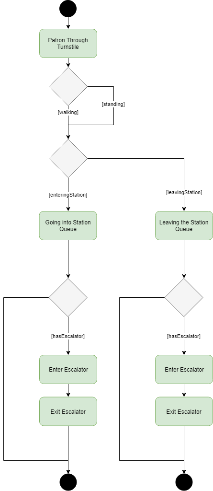

## Subway Escalator Problem: Behavior Diagram - Activity Diagram

The below diagram illustrates an activity diagram of the how a patron transits through the simulation. This path is the same for patrons entering and exiting except that there is a entering turnstile queue and escalator and a exiting turnstile queue and escalator.

1. Patrons will come through the turnstile be assigned walking or standing on the escalator. 
2. Then will enter either the enteringStation queue or the exitingStation queue
3. If there is not an escalator going the needed direction (Entering = Going down, Exiting = Going up) when the patron will exit the simulation because they are forced to take the stair which are out of scope of this project. If there is an escalator, then the patron will enter the escalator and either walk or stand depending on their assignment given earlier.
4. After riding the 60 feet, the patron will exit the escalator and leave the simulation.

