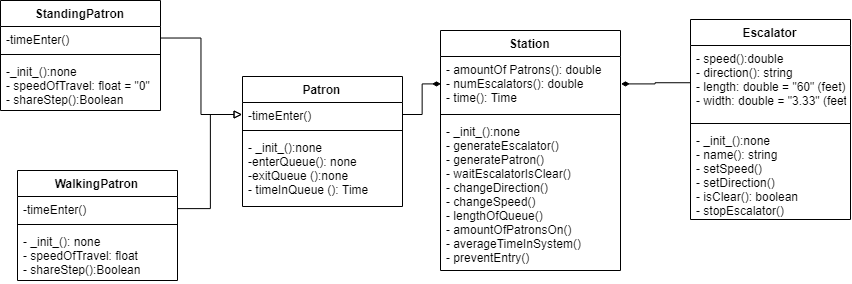

## Subway Escalator Problem: Class Diagram

The below diagram illustrates the attributes and operations of the classes in this subway escalator problem. The bulleted list below describes the these attributes and operations show in the diagram.

**Patrons**
* A patron can either be standing or walking. Depending on the simualtion, all patrons could be standing or walking or a combination.
* Each patron object created will have a time associated to when it entered the simulation and when it exited.
* A different speed of travel can be associated to a patron. Standers will have a speed of zero, but a walking patron may transit faster than another. 
* The queue is a simple queue. The patrons entering the system will be respectful and not attempt to push through to when a line forms
* The patrons can share a step with another patron.
* Patrons can walk at the same speed on the same step.

**Escalator**
* The speed and direction of the escalator can be adjusted when the escalator is clear and stopped.
* The speed of the escalator will aid in the indication of how quickly a new step appears for an escalator.
* The length of the escalator will be set to average length of 60 feet.
* The width of each step of the escalator will be set to the standard 24 inches or 3.33 feet.


**Station**
* Each station has a set number of escalators depending on the station
* The time of day will indicate how many people should traverse through the turnstiles
* The queue of the patrons will be managed in the station class and will be a simple queue (first in, first out(FIFO))
* The time it take for a patron to transit into the queue, onto the escalator, and off the escalator will be calculated.
* The amount of people in the queue will be kept
* The speed of patrons getting on the escalator will depend on if the patron shares the step and the speed of the escalator

