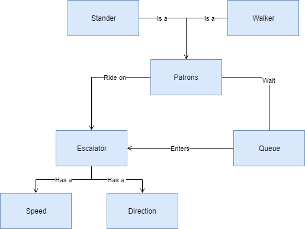

#Subway Escalator Problem: Object Diagram

The below diagram illustrates the basic relationships of objects in this subway escalator problem. The bulleted list below describes the relationships of the diagram.

* Patrons can either be a stander or walker on the escalator.
* The patrons will enter a queue to wait to enter the escalator.
* The patrons will ride the escalator.
* The escalator will have a direction and either go up to down or down to up.
* The escalator will have a speed between 90 - 180 feet per min.

